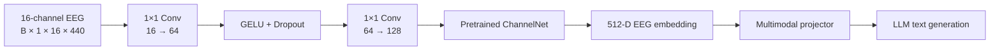

# Thought2Text-16Ch BCI

**A parameter-efficient 16-channel brain-computer interface for EEG-to-text
generation, model compression, and edge-deployment experiments.**

[](LICENSE)
[](pyproject.toml)
[](#data-and-privacy)

This BCI project adapts the research pipeline from
[Thought2Text](https://github.com/abhijitmishra/Thought2Text) from a
128-channel laboratory EEG setup to an OpenBCI-like 16-channel montage. A
small learnable adapter reconstructs the feature layout expected by the
pretrained ChannelNet encoder while preserving the original temporal
resolution.

The repository is intentionally portfolio-ready and data-free. It contains
the model implementation, released encoder weights, compression and export
tools, tests, and aggregate results—but no EEG recordings, images, subject
identifiers, captions, experiment caches, or LLM weights.

## What I built

| Contribution | Implementation | Why it matters |
|---|---|---|
| Low-density EEG adaptation | Two-layer 1×1 channel adapter: 16→64→128 | Reuses a 128-channel encoder with only 9,216 adapter parameters |
| Sensor-input compression | 128 channels reduced to 16 | 8× fewer sampled EEG channels and lower acquisition bandwidth |
| Flexible preprocessing | Named 10–20 montage selection with legacy aliases | Makes the channel mapping explicit and reproducible |
| Weight compression | FP32 and FP16 encoder bundles | Reduces checkpoint storage from 20.01 MiB to 10.01 MiB |
| Edge-readiness testing | Synthetic CPU benchmark and portable graph export | Measures inference without exposing or packaging EEG data |
| Reproducibility cleanup | Offline loading, smoke tests, model card, checksums | Separates portfolio code and weights from private research artifacts |

## Architecture



The adapter mixes electrode channels independently at every time step. It
does not interpolate the time axis or add recurrent state. The full upstream
EEG-to-text system aligns the 512-dimensional EEG embedding with CLIP visual
embeddings and then conditions an LLM. This repository focuses on the
low-density EEG front end and does not redistribute the multi-gigabyte LLM.

## Compression summary

There are two distinct reductions in this experiment:

1. **Input-dimensionality reduction:** 128 EEG channels → 16 channels (8×).
2. **Checkpoint storage reduction:** FP32 → FP16 weights (50.0%).

The 16-channel adapter is parameter-efficient, but it does not prune the
5.24M-parameter ChannelNet backbone. FP16 is a storage optimization; actual
latency and memory gains depend on the target runtime and hardware.

| Bundle | Size |
|---|---:|
| FP32 ChannelNet + adapter | 20.01 MiB |
| FP16 ChannelNet + adapter | 10.01 MiB |
| Storage reduction | 50.0% |

## Experimental results

| Pipeline | Channels | Best encoder accuracy | Generated-object accuracy |
|---|---:|---:|---:|
| Upstream-style baseline | 128 | 52.19% | 44.49% (884 / 1,987) |
| Low-density adaptation | 16 | 38.94% | 30.10% (598 / 1,987) |

The reduced-channel model retains a measurable semantic signal, but it does
not match the 128-channel baseline. The runs used different optimization
schedules, so these values are feasibility evidence rather than a strict
controlled ablation. See [the results notes](docs/RESULTS.md) for limitations.

## Quick start

```bash
git clone https://github.com/quantumdotsss/Thought2Text-16Ch-BCI.git
cd Thought2Text-16Ch-BCI
python -m venv .venv
source .venv/bin/activate
python -m pip install -e .
```

Load the released bundle and run a synthetic, data-free forward pass:

```python
import torch
from thought2text_edge import load_pretrained_bundle

model = load_pretrained_bundle("weights")
synthetic_eeg = torch.zeros(1, 1, 16, 440)

with torch.inference_mode():
    embedding, logits = model(synthetic_eeg)

print(embedding.shape)  # [1, 512]
print(logits.shape)     # [1, 40]
```

## Edge export and benchmark

Export the fixed-shape encoder graph using the locally validated TorchScript
path:

```bash
python -m scripts.export_edge \
  --format torchscript \
  --output artifacts/eeg_encoder_torchscript.pt
```

`--format export` is also provided for environments where the installed
PyTorch/Python combination supports `torch.export`; it is an intermediate
graph for downstream edge-runtime lowering, not a finished Android or iOS
application.

Run a single-thread CPU proxy benchmark:

```bash
python -m scripts.benchmark_edge --threads 1 --iterations 30
```

Local validation on an AMD Ryzen 9 9900X with PyTorch 2.3 produced:

| Metric | Result |
|---|---:|
| Mean latency | 203.683 ms |
| Median latency | 203.545 ms |
| P95 latency | 206.684 ms |
| Input | 1 × 1 × 16 × 440 |

These numbers are a desktop CPU edge-readiness proxy, **not a measurement on
a phone**. See [the benchmark record](docs/BENCHMARK.md).

## Selecting the 16-channel montage

The selected 10–20 channels are:

```text
Fp1, Fp2, F7, F3, F4, F8, T7, C3,
C4, T8, P7, P3, P4, P8, O1, O2
```

The selector also recognizes the legacy aliases T3→T7, T4→T8, T5→P7, and
T6→P8. It expects a NumPy array shaped `[trials, channels, time]` and a JSON
list of channel names:

```bash
python -m scripts.select_channels \
  --input /path/to/local/eeg.npy \
  --channel-names /path/to/local/channel_names.json \
  --output /path/to/local/eeg_16ch.npy
```

The output remains local and is ignored by Git.

## Released weights

The [model card](weights/MODEL_CARD.md) documents the four released files.
SHA-256 checksums are provided in [weights/SHA256SUMS](weights/SHA256SUMS).

The weights contain model parameters only. Optimizer state and the full
Mistral model are deliberately excluded.

## Verification

```bash
python -m pytest -q
python scripts/compress_weights.py --weights weights
sha256sum -c weights/SHA256SUMS
```

Current local test result: **5 passed**.

## Data and privacy

This public repository contains no:

- raw or processed EEG trials;
- images or generated per-sample captions;
- subject IDs, health information, or consent documents;
- local paths, API keys, environment files, or experiment-tracking logs;
- optimizer checkpoints or full LLM weights.

To reproduce training, obtain the dataset independently by following the
provenance and access instructions in the upstream project. Do not commit
participant data to a fork of this repository.

## Scope and responsible use

This is an early controlled-stimulus research experiment. It does not decode
arbitrary private thoughts, is not a medical device, and must not be used for
diagnosis, treatment, surveillance, or decisions about individuals.

## Acknowledgements

This repository extends the MIT-licensed
[Thought2Text](https://github.com/abhijitmishra/Thought2Text) project. The
ChannelNet backbone originates from Palazzo et al., *Decoding Brain
Representations by Multimodal Learning of Neural Activity and Visual
Features*, IEEE TPAMI, 2020. See [NOTICE.md](NOTICE.md) for attribution.

## License

MIT. See [LICENSE](LICENSE).
